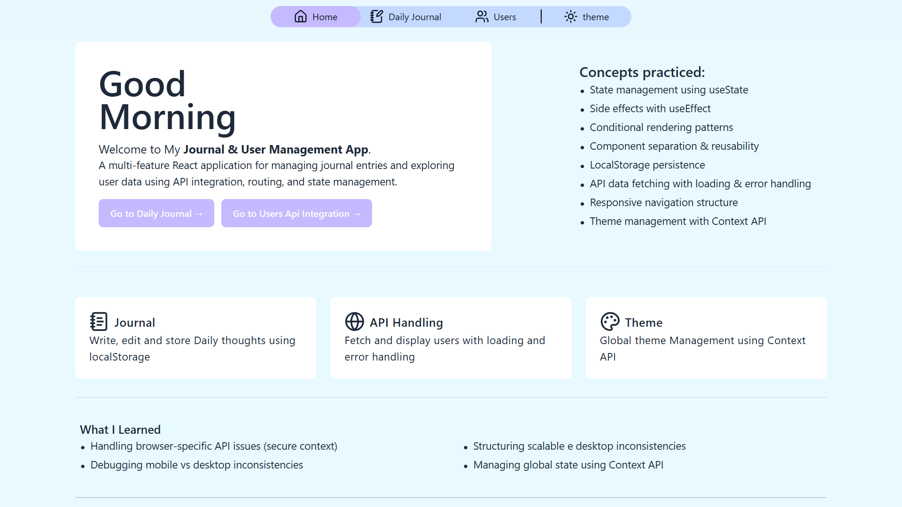
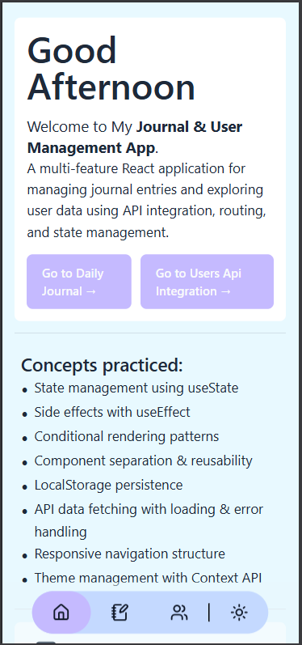
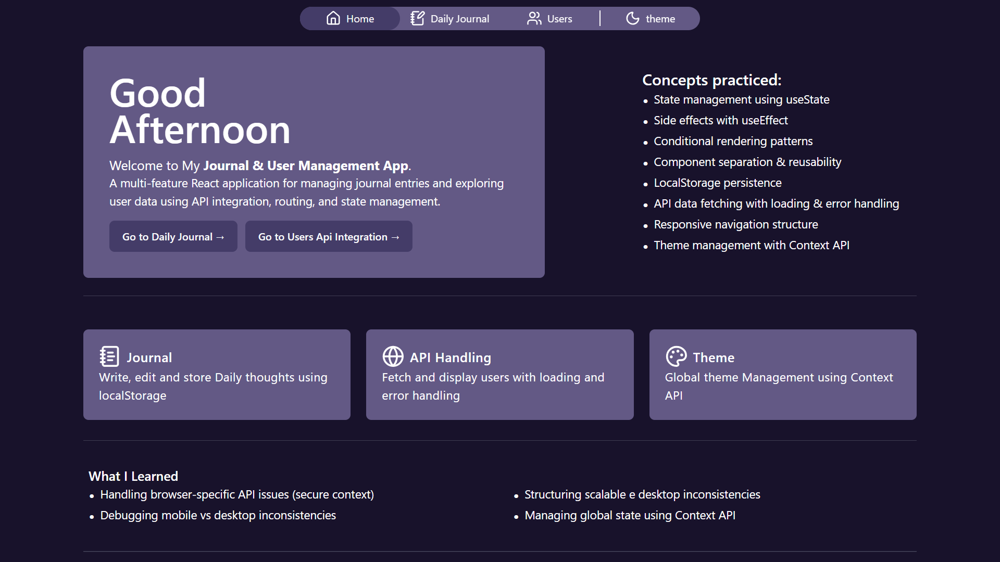
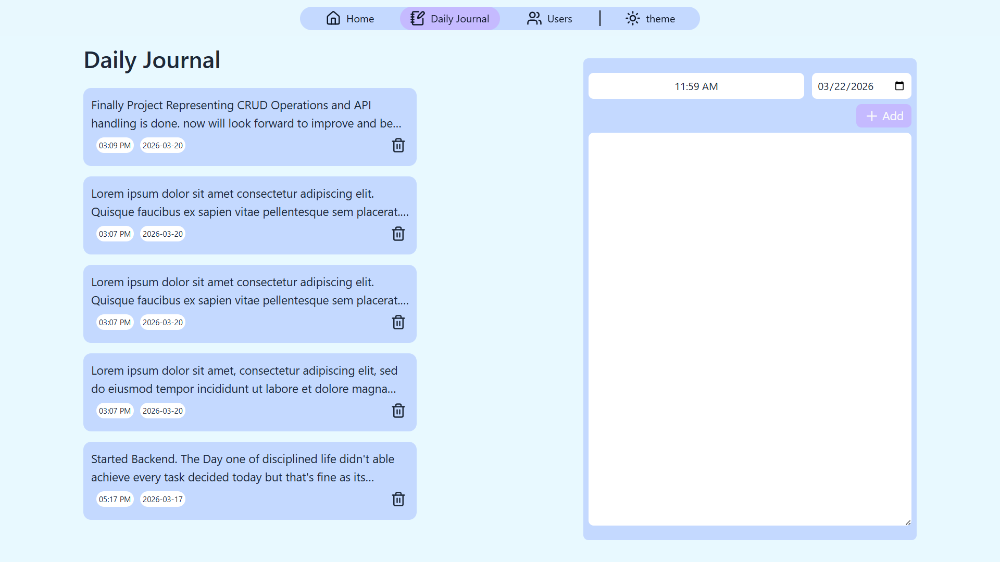
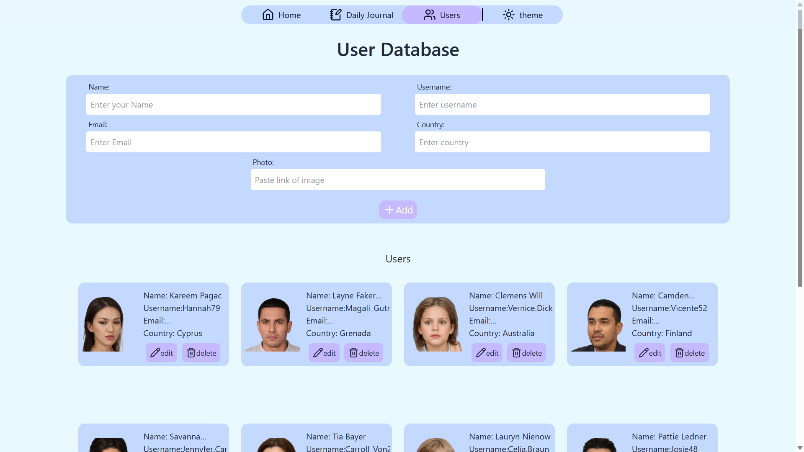

# Journal & User Management App

A multi-feature React application designed to manage journal entries and explore user data using real-world frontend patterns such as API integration, routing, and state management.

---

## 🔗 Live Demo

[](https://journal-user-management-opdev.vercel.app/)

---

### Home

<p align="center">
  
  &nbsp;&nbsp;&nbsp;
  
</p>

### Home(Dark mode)



### Daily Journal



### Users(Api handling)



---

## 🚀 Features

### 🗒 Daily Journal

- Add, edit, and delete journal entries
- LocalStorage persistence
- Date & time tracking
- Controlled form handling
- Mobile-friendly layout

### 🌐 Users API Integration

- Fetch users from a public fake API
- Loading and error handling states
- Conditional rendering patterns
- Reusable component structure

### 🎨 Theme Management

- Light/Dark theme toggle
- Global state using Context API
- Clean separation of concerns

### 📱 Responsive Navigation

- Multi-route navigation using React Router
- Mobile-compatible layout
- Clean and minimal UI design

---

## 🧠 Key Features & Concepts

- `useState` for local state management
- `useEffect` for side effects
- Controlled components
- Conditional rendering
- Component reusability
- Context API for global state
- LocalStorage persistence
- API data fetching
- Error & loading state handling
- Responsive layout design

---

## 🏗 Tech Stack

- React.js
- React Router
- Tailwind CSS
- Lucide React Icons
- Vite

---

## 🔐 Notes

- Entry IDs use Date.now() to ensure compatibility during LAN/mobile development.
- Designed to simulate real-world frontend application behavior.
- No backend integration (yet).

---

## 🧠 What This Project Demonstrates

- Handling real-world UI states (loading, error, empty)
- Managing application state using React Hooks and Context API
- Structuring scalable and reusable components
- Integrating REST APIs and handling asynchronous data
- Implementing client-side routing using React Router

---

## 📂 Project Structure

```

journal-user-management-app/
├── src/
│   ├── assets/
│
│   ├── components/
│   │   ├── Btns.jsx
│   │   ├── HomeCard.jsx
│   │   ├── JournalCard.jsx
│   │   ├── JournalForm.jsx
│   │   ├── LoadingState.jsx
│   │   ├── MetaData.jsx
│   │   ├── UserCard.jsx
│   │   ├── UserForm.jsx
│   │   ├── UserModal.jsx
│   │   └── UsersDBinp.jsx
│
│   ├── context/
│   │   └── ThemeContext.jsx
│
│   ├── pages/
│   │   ├── Home.jsx
│   │   ├── DailyJournal.jsx
│   │   └── UsersDB.jsx
│
│   ├── services/
│   │   ├── api.js
│   │   ├── currentDateNTime.js
│   │   ├── storageServices.js
│   │   └── userServices.js
│
│   ├── App.jsx
│   ├── App.css
│   ├── index.css
│   └── main.jsx
│
├── .gitignore
├── eslint.config.js
├── index.html
├── package.json
├── package-lock.json
├── vite.config.js
└── README.md
```

---

## ⚙ Installation & Setup

Clone the repository:

```bash
git clone https://github.com/om-patil25/react-journal-user-management-app.git
cd react-journal-user-management-app
```

## Install dependencies:

```bash
npm install
```

## Run development server:

```bash
npm run dev
```
